# Presentación

Este documento contiene el proyecto final del curso de **Métodos Estadísticos**. 

En este trabajo se presenta el Análisis Exploratorio de Datos (EDA), pruebas de hipótesis, modelación y conclusiones referentes al conjunto de datos Concrete Compressive Strength (Resistencia del Concreto).

## Estructura del Documento

- **Capítulo 1**: Introducción y Objetivos del Estudio.
- **Capítulo 2**: Análisis Exploratorio de Datos (EDA).
- **Capítulos siguientes**: Modelación y Conclusiones.


<!--chapter:end:index.Rmd-->

# Introducción y Objetivos {#intro}

## Contexto

En la ingeniería civil y los materiales de construcción, la resistencia a la compresión del concreto es una propiedad fundamental que determina la calidad y seguridad de las estructuras. Su propiedad mecánica más crítica es la resistencia a la compresión, ya que determina la capacidad de carga que tiene el material y una estructura de sopartar sin colapasar. De forma tradicional, la verificación de resistencia necesita un periodo estándar de 28 días de curado, es decir el proceso de control de la humedad y la temperatura para garantizar que el cemento mantenga la hidratación adecuada durante sus primeras etapas de endurecimiento.

## Problemática
En la industria de la construcción y la ingeniería civil, la resistencia de la compresión de concreto es la propiedad mecánica que garantiza la seguridad de millones de estructuras en el mundo. La sustitución parcial de cemento por ceniza volante tambien conocido como "fly ash" es una alternativa económica y sostenible en la construcción; sin embargo, al ser un material de reacción lenta, existe incertidumbre sobre si compromete la resistencia del concreto en edades tempranas (1 a 7 días) o si la incrementa con un mayor tiempo de curado (28 a 90+ días).

Por tanto, el problema central radica en determinar estadísticamente: ¿En qué medida el uso de ceniza volante y el tiempo de curado influyen en la resistencia a la compresión del concreto a lo largo de sus distintas etapas de maduración?

## Objetivos del Proyecto
### Objetivo general
Evaluar el impacto de la incorporación de ceniza volante (Fly Ash) y del tiempo de curado sobre la resistencia a la compresión del concreto, mediante análisis inferencial y pruebas de hipótesis, para determinar la viabilidad técnica y el comportamiento mecánico de estas formulaciones.

### Objetivos especificos 

1. Estimar los intervalos de confianza y verificar los supuestos de normalidad para la resistencia del concreto y la dosificación de ceniza volante. 

2. Comparar la resistencia media a la compresión entre mezclas con y sin ceniza volante, calculando el tamaño del efecto. 

3.Evaluar las diferencias de resistencia entre las etapas de curado (temprana, estándar y tardía) mediante análisis de varianza y pruebas post-hoc.

4. Determinar el grado de correlación entre la cantidad de ceniza volante dosificada y la resistencia alcanzada en el material. 
    
## Justificación

La ceniza volante es un residuo industrial considerablemente más barato que el cemento tradicional; validar su eficacia permite reducir los costos de fabricación de las mezclas sin comprometer la calidad.


<!--chapter:end:01-introduccion.Rmd-->

# Análisis Exploratorio de Datos (EDA) {#eda}

En este capítulo analizamos las variables cuantitativas del dataset de Concrete Compressive Strength (Resistencia del Concreto).

## Dataset y ficha tecnica

- **Fuente:** UCI Machine Learning Repository (Donado por el Prof. I-Cheng Yeh, 2007).

- **Área:** Ingeniería Civil / Ciencia de Materiales.

- **Número de Observaciones (**N**):** 1,030 mezclas experimentales.

- **Número de Variables:** 9 variables cuantitativas (8 independientes + 1 dependiente).

- **Valores Faltantes:** Ninguno.

## Importamos librerias


``` r
library(tidyverse) 
library(moments) 
library(patchwork) 
library(GGally) 
library(dplyr) 
library(effsize) 
library(rstatix)
library(lmtest)   
library(car)      
library(janitor)  
```

## Carga de Datos


``` r
library(readxl)
Concrete_Data <- read_excel("concrete+compressive+strength/Concrete_Data.xls")

df<- Concrete_Data
```

## Diccionario de Variables
Aclaramos que cada observacion representa un ensayo de laboratorio con una receta individual con ingredientes mezclados para hacer un metro cubico de cemento, el tiempo que se dejo reposar y la fuerza que resistio.

Todas las variables son cuantitativas continuas:

| Variable | Nombre en Dataset | Tipo | Unidad | Descripción |
|:--------------|:--------------|:--------------|:--------------|:--------------|
| **1. Cemento** | `Cement` | Entrada (Indep.) | $\text{kg/m}^3$ | Componente aglutinante principal. |
| **2. Escoria de alto horno** | `Blast_Furnace_Slag` | Entrada (Indep.) | $\text{kg/m}^3$ | Subproducto siderúrgico que mejora durabilidad. |
| **3. Ceniza volante** | `Fly_Ash` | Entrada (Indep.) | $\text{kg/m}^3$ | Subproducto de centrales térmicas. |
| **4. Agua** | `Water` | Entrada (Indep.) | $\text{kg/m}^3$ | Cantidad de agua. |
| **5. Superplastificante** | `Superplasticizer` | Entrada (Indep.) | $\text{kg/m}^3$ | Aditivo químico que reduce necesidad de agua. |
| **6. Agregado Grueso** | `Coarse_Aggregate` | Entrada (Indep.) | $\text{kg/m}^3$ | Grava / Piedra chancada. |
| **7. Agregado Fino** | `Fine_Aggregate` | Entrada (Indep.) | $\text{kg/m}^3$ | Arena. |
| **8. Edad** | `Age` | Entrada (Indep.) | Días ($1 \text{ a } 365$) | Tiempo de maduración/curado del concreto. |
| **9. Resistencia** | `Concrete_Compressive_Strength` | **Salida (Dependiente)** | $\text{MPa}$ | Resistencia final a la compresión. |

## Exploración del data set.

Resumimos los nombres de las variables

``` r
df_clean <- df %>%
  rename(
    cemento          = `Cement (component 1)(kg in a m^3 mixture)`,
    escoria          = `Blast Furnace Slag (component 2)(kg in a m^3 mixture)`,
    ceniza           = `Fly Ash (component 3)(kg in a m^3 mixture)`,
    agua             = `Water  (component 4)(kg in a m^3 mixture)`,
    superplast       = `Superplasticizer (component 5)(kg in a m^3 mixture)`,
    agregado_grueso  = `Coarse Aggregate  (component 6)(kg in a m^3 mixture)`,
    agregado_fino    = `Fine Aggregate (component 7)(kg in a m^3 mixture)`,
    edad             = `Age (day)`,
    resistencia      = `Concrete compressive strength(MPa, megapascals)`
  )
```

### Exploración de la variable de respuesta


``` r
df_clean %>% summarise(n = length(resistencia),
                 media = mean(resistencia),
                 sd = sd(resistencia),
                 mediana = median(resistencia),
                 RIC = IQR(resistencia),
                 Q1 = quantile(resistencia, 0.25),
                 Q3 = quantile(resistencia, 0.75),
                 minimo = min(resistencia),
                 maximo = max(resistencia),
                 asim = skewness(resistencia),
                 curtosis = kurtosis(resistencia))
```

```
## # A tibble: 1 × 11
##       n media    sd mediana   RIC    Q1    Q3 minimo maximo  asim curtosis
##   <int> <dbl> <dbl>   <dbl> <dbl> <dbl> <dbl>  <dbl>  <dbl> <dbl>    <dbl>
## 1  1030  35.8  16.7    34.4  22.4  23.7  46.1   2.33   82.6 0.416     2.68
```
Vemos que las 1030 observaciones de mezclas de concreto, tienen una resistencia de comprension de 35.817 MPa, con una desviación estándar de 16.70 MPa. Además, el 50% de las mezclas tienen una resistencia igual o menor a 34.442 MPa. Además, se observa una mezcla de concreto experimental con resistencia de 85.59 MPa siendo esta la observación con mayor Resistencia final a la compresión y otras con la minima resistencia entre las observaciones con 2.33 MPa.


``` r
options(scipen = 999)
df_clean |> 
  ggplot(aes(x = resistencia)) +
  geom_histogram(
    aes(y = after_stat(density)),
    binwidth = 2,
    fill = "darkblue",
    color = "white",
    alpha = 0.6
  ) +
  geom_density(color = "darkblue", linewidth = 1.2) +
  labs(
    title = "Distribución de la resistencia del concreto",
    x = "Resistencia",
    y = "Densidad"
  ) +
  theme_bw()
```

<div class="figure" style="text-align: center">
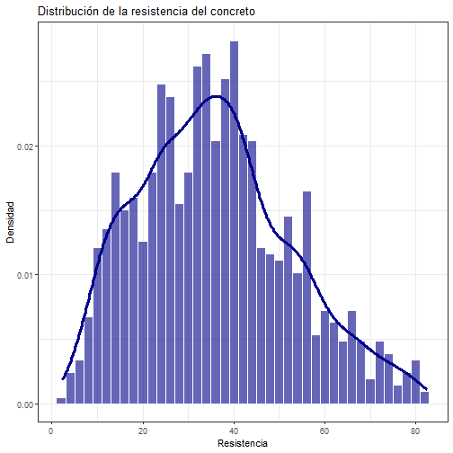
<p class="caption">plot of chunk unnamed-chunk-3</p>
</div>
la resistencia muestra una distribución con forma parecida a una **simétrica con forma de campana**, centrada en torno a los $35\text{ MPa}$ y abarcando un rango desde los $2.3$ hasta los $82.6\text{ MPa}$. La curva de densidad sugiere un comportamiento cercano a la **distribución normal**, reflejando una muestra equilibrada que abarca desde concretos convencionales hasta mezclas de alto rendimiento.
## Exploracion de las varibles independientes

Creamos la siguiente tabla para observar de forma descriptiva las variables independientes que analizaremos y asi complementar el analisis de los boxplots con ella.


``` r
tabla_independientes <- df_clean |> select(ceniza, edad) |> 
  pivot_longer(
    cols = everything(),
    names_to = 'variables',
    values_to = 'valor'
  ) |> 
  group_by(variables) |> 
             summarise(    
    n = length(valor),
    media = round(mean(valor), 3),
    sd = round(sd(valor),3),
    mediana = round(median(valor), 3),
    RIC = round(IQR(valor), 3),
    Q1 = round(quantile(valor, 0.25), 3),
    Q3 = round(quantile(valor, 0.75), 3),
    minimo  = round(min(valor), 3),
    maximo  = round(max(valor), 3),
    asim    = round(skewness(valor), 3),
    curtosis = round(kurtosis(valor), 3))

tabla_independientes
```

```
## # A tibble: 2 × 12
##   variables     n media    sd mediana   RIC    Q1    Q3 minimo maximo  asim
##   <chr>     <int> <dbl> <dbl>   <dbl> <dbl> <dbl> <dbl>  <dbl>  <dbl> <dbl>
## 1 ceniza     1030  54.2  64.0       0  118.     0  118.      0   200. 0.537
## 2 edad       1030  45.7  63.2      28   49      7   56       1   365  3.26 
## # ℹ 1 more variable: curtosis <dbl>
```


``` r
df_clean |> 
  ggplot(aes(x = ceniza)) +
  geom_histogram(
    aes(y = after_stat(density)),
    binwidth = 10,           # Intervalos de 10 kg/m^3
    fill = "#d95f02",        # Tono naranja / teja
    color = "white",
    alpha = 0.6
  ) +
  geom_density(color = "#d95f02", linewidth = 1.2) +
  labs(
    title = "Distribución del contenido de Ceniza Volante",
    x = "Ceniza Volante (kg/m³)",
    y = "Densidad"
  ) +
  theme_bw()
```

<div class="figure" style="text-align: center">
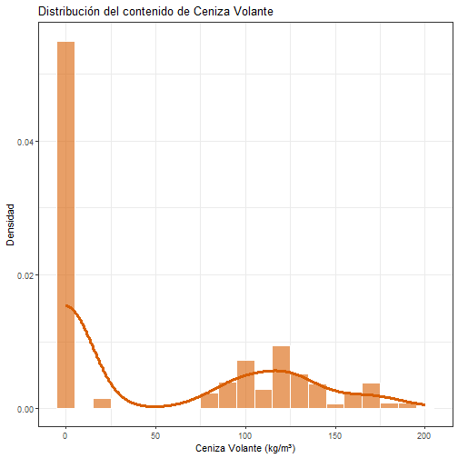
<p class="caption">plot of chunk unnamed-chunk-5</p>
</div>
La distribución es fuertemente bimodal e inflada en ceros. Presenta una concentración masiva en los $0\text{ kg/m}^3$ correspondiente a las mezclas tradicionales de control ($55\%$ de la muestra), seguida de un segundo agrupamiento entre los $80$ y $160\text{ kg/m}^3$ en aquellas formulaciones donde sí se sustituyó cemento por ceniza. Esta notable asimetría y falta de continuidad confirma la **no normalidad** de la variabl.


``` r
df_clean |> 
  ggplot(aes(x = edad)) +
  geom_histogram(
    aes(y = after_stat(density)),
    binwidth = 14,           # Intervalos de 14 días (2 semanas)
    fill = "#7570b3",        # Tono violeta
    color = "white",
    alpha = 0.6
  ) +
  geom_density(color = "#7570b3", linewidth = 1.2) +
  labs(
    title = "Distribución del Tiempo de Curado",
    x = "Tiempo de Curado (Días)",
    y = "Densidad"
  ) +
  theme_bw() 
```

<div class="figure" style="text-align: center">
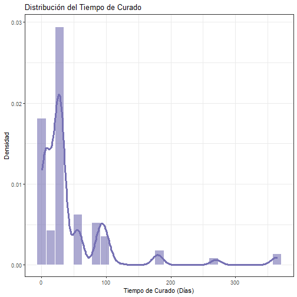
<p class="caption">plot of chunk unnamed-chunk-6</p>
</div>
La distribución exhibe un marcado sesgo positivo con picos, concentrando la gran mayoría de las observaciones en los $28\text{ días}$ la cual es la edad estándar de diseño y en periodos tempranos ($\le 7\text{ días}$). La densidad decae drásticamente a partir de los $56\text{ días}$, extendiéndose en una cola larga hasta los $365\text{ días}$, lo cual evidencia una distribución **no normal** explicada por el diseño experimental enfocado en etapas normativas de obra.

## Anlisis Univariado de las variables


``` r
# 1. Boxplot de Ceniza Volante
p1 <- df %>%
  ggplot(aes(x = "", y = `Fly Ash (component 3)(kg in a m^3 mixture)`)) +
  geom_boxplot(fill = "#d62728", alpha = 0.7) +
  labs(
    title = "Ceniza Volante (Fly Ash)",
    y = "Ceniza Volante (kg/m³)",
    x = ""
  ) +
  theme_bw()


# 2. Boxplot de Edad de Curado
p2 <- df %>%
  ggplot(aes(x = "", y = `Age (day)`)) +
  geom_boxplot(fill = "#e377c2", alpha = 0.7) +
  labs(
    title = "Tiempo de Curado",
    y = "Edad (Días)",
    x = ""
  ) +
  theme_bw()

# 3. Boxplot de Resistencia a la Compresión (Target / Variable Respuesta)
p3 <- df %>%
  ggplot(aes(x = "", y = `Concrete compressive strength(MPa, megapascals)`)) +
  geom_boxplot(fill = "#bcbd22", alpha = 0.7) +
  labs(
    title = "Resistencia a la Compresión",
    y = "Resistencia (MPa)",
    x = ""
  ) +
  theme_bw()
```


``` r
p1 
```

<div class="figure" style="text-align: center">
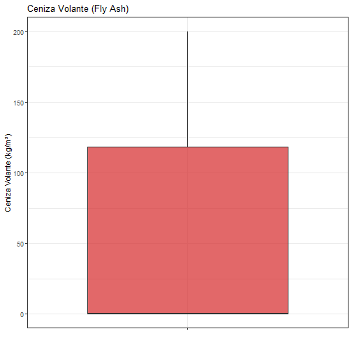
<p class="caption">plot of chunk unnamed-chunk-7</p>
</div>
### Analisis boxplot Fly Ash

Se observa una distribución atipica con alta dispersión de los datos,  además por la tabla anterior la media del uso de ceniza en las mezclas es $54.2 kg/m^3$ y una desviación estándar de $64 kg/m^3$

Sin embargo el diagrama de caja muestra que el 50% de los valores de ceniza coincide con el limite inferior, esto indica que el 50% de las mezclas no contienen contienen ceniza volante. Por otra parte, el 75% de las observaciones contienen una cantidad de ceniza menor o igual a $118.6 kg/m^3$, mientras que el migote señala mezclas con un maximo de $201.1 kg/m^3$, no se evidencia ningun valor atipico.

¿porque hay este comportamiento de los datos centrado en cero?
esto se debe a que el conjunto de datos contiene mezclas de control convencionales elaboradas exclusivamente con cemento tradicional para servir de base comparativa. Por ende, la ceniza volante actúa como un componente opcional.

### Analisis boxplot tiempo de curado

``` r
p2
```

<div class="figure" style="text-align: center">
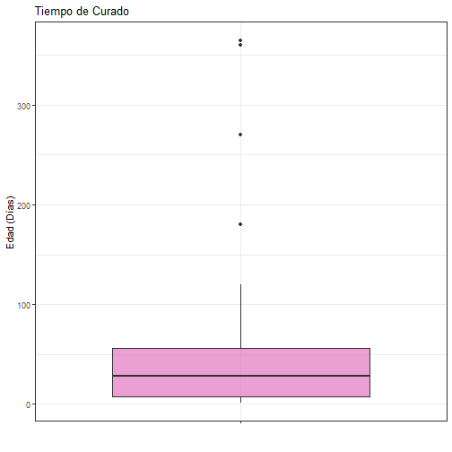
<p class="caption">plot of chunk unnamed-chunk-8</p>
</div>

La variable $\text{Age}$ (días de curado) presenta una concentración en edades tempranas y unagran dispersión, reflejada en un tiempo promedio de curado de $45.7\text{ días}$ y una desviación estándar de $63.2\text{ días}$.

El boxplot nos permite observar una distribución sesgada a la derecha, tambien el $50\%$ de las muestras fueron ensayadas a los $28\text{ días}$ o menos, el $25\%$ inferior corresponde a edades tempranas iguales o menores a $7\text{ días}$, y el $75\%$ central se concentra por debajo de los $56\text{ días}$. No obstante, el diagrama de caja evidencia una serie de **valores extremos** en la parte superior, con esayos a los $90$, $180$, $270$ y hasta un máximo de $365\text{ días}$ es decir un año completo de curado.

**¿Por qué existen valores atípicos tan elevados?**  
En la práctica de la ingeniería civil, los ensayos estándar de control de calidad se realizan de forma rutinaria a los $7$, $14$ y principalmente a los $28\text{ días}$. Los tiempos de curado prolongados ($> 90\text{ días}$) son ensayos de investigación concebidos para evaluar la durabilidad a largo plazo y la reacción tardía de adiciones minerales como la ceniza volante.


``` r
p3
```

<div class="figure" style="text-align: center">
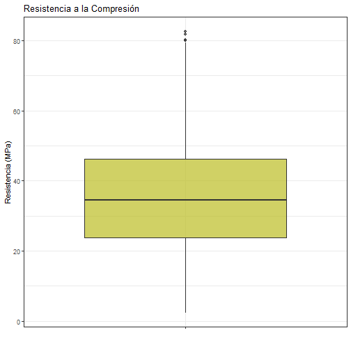
<p class="caption">plot of chunk unnamed-chunk-9</p>
</div>


Para la variable objetivo "resistencia", se observa un comportamiento mucho más homogéneo y balanceado, con un promedio de resistencia de $35.8\text{ MPa}$ y una desviación estándar de $16.7\text{ MPa}$.

El 50% de los datos tienen una resistencia menor o igual a $34.5\text{ MPa}$, mostrando una **notable cercanía con el promedio de resistencia de las mezclas de concreto ($35.8\text{ MPa}$)**. En cuanto al rango intercuartílico, el $25\%$ de las mezclas con menor resistencia registran valores iguales o inferiores a $23.7\text{ MPa}$, mientras que el $75\%$ de las muestras se sitúan por debajo de los $46.1\text{ MPa}$. Los bigotes abarcan un rango que va desde un mínimo de $2.3\text{ MPa}$ (concreto de muy baja resistencia) hasta aproximadamente los $80.0\text{ MPa}$. Se aprecian únicamente unos pocos **valores atípicos superiores** que alcanzan un máximo de $82.6\text{ MPa}$.  

#Analisis Bivariado


``` r
df_clean %>% select(ceniza, edad, resistencia) |> 
  ggpairs()
```

<div class="figure" style="text-align: center">
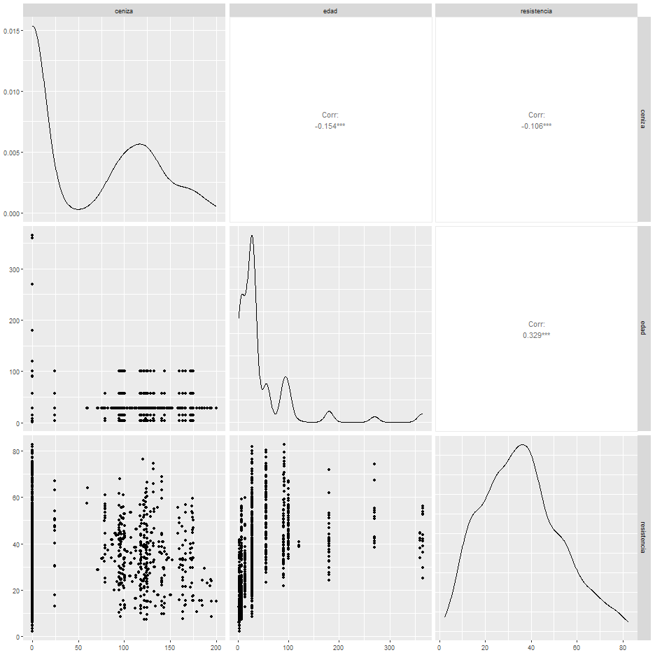
<p class="caption">plot of chunk unnamed-chunk-10</p>
</div>


``` r
# --- 1. PRUEBAS ESTADÍSTICAS DE NORMALIDAD ---

# Prueba de Shapiro-Wilk para la variable de respuesta
shapiro.test(df_clean$resistencia)
```

```
## 
## 	Shapiro-Wilk normality test
## 
## data:  df_clean$resistencia
## W = 0.97979, p-value = 0.00000000009023
```

``` r
# Prueba de Shapiro-Wilk para las variables independientes
shapiro.test(df_clean$ceniza)
```

```
## 
## 	Shapiro-Wilk normality test
## 
## data:  df_clean$ceniza
## W = 0.76201, p-value < 0.00000000000000022
```

``` r
shapiro.test(df_clean$edad)
```

```
## 
## 	Shapiro-Wilk normality test
## 
## data:  df_clean$edad
## W = 0.59071, p-value < 0.00000000000000022
```

``` r
# Tip: Si deseas aplicar la prueba a TODAS las columnas al mismo tiempo
lapply(df_clean, shapiro.test)
```

```
## $cemento
## 
## 	Shapiro-Wilk normality test
## 
## data:  X[[i]]
## W = 0.95896, p-value < 0.00000000000000022
## 
## 
## $escoria
## 
## 	Shapiro-Wilk normality test
## 
## data:  X[[i]]
## W = 0.81241, p-value < 0.00000000000000022
## 
## 
## $ceniza
## 
## 	Shapiro-Wilk normality test
## 
## data:  X[[i]]
## W = 0.76201, p-value < 0.00000000000000022
## 
## 
## $agua
## 
## 	Shapiro-Wilk normality test
## 
## data:  X[[i]]
## W = 0.9804, p-value = 0.0000000001473
## 
## 
## $superplast
## 
## 	Shapiro-Wilk normality test
## 
## data:  X[[i]]
## W = 0.86605, p-value < 0.00000000000000022
## 
## 
## $agregado_grueso
## 
## 	Shapiro-Wilk normality test
## 
## data:  X[[i]]
## W = 0.98245, p-value = 0.0000000008346
## 
## 
## $agregado_fino
## 
## 	Shapiro-Wilk normality test
## 
## data:  X[[i]]
## W = 0.98067, p-value = 0.0000000001843
## 
## 
## $edad
## 
## 	Shapiro-Wilk normality test
## 
## data:  X[[i]]
## W = 0.59071, p-value < 0.00000000000000022
## 
## 
## $resistencia
## 
## 	Shapiro-Wilk normality test
## 
## data:  X[[i]]
## W = 0.97979, p-value = 0.00000000009023
```

``` r
# --- 2. VALIDACIÓN VISUAL (Q-Q PLOTS) ---

# Gráfico para la Resistencia
qqnorm(df_clean$resistencia, pch = 1, frame = FALSE, 
       main = "Gráfico Q-Q: Resistencia a la Compresión")
qqline(df_clean$resistencia, col = "red", lwd = 2)
```

<div class="figure" style="text-align: center">
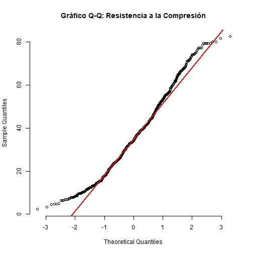
<p class="caption">plot of chunk unnamed-chunk-11</p>
</div>

``` r
# Gráfico para la Edad
qqnorm(df_clean$edad, pch = 1, frame = FALSE, 
       main = "Gráfico Q-Q: Tiempo de Curado (Edad)")
qqline(df_clean$edad, col = "red", lwd = 2)
```

<div class="figure" style="text-align: center">
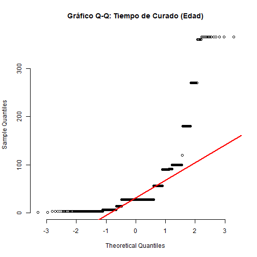
<p class="caption">plot of chunk unnamed-chunk-11</p>
</div>
1. Interpretación del Gráfico Q-Q para la Resistencia a la Compresión

Comportamiento central: En el centro del gráfico, la gran mayoría de los puntos se alinean bastante bien sobre la línea diagonal roja. Esto indica que los valores medios de resistencia (alrededor de los 35 MPa) tienen un comportamiento muy cercano a una distribución simétrica normal.

Desviación en los extremos (Colas): El gráfico seguramente muestra que los puntos se separan ligeramente de la línea roja en el extremo inferior (esquina inferior izquierda) y en el extremo superior (esquina superior derecha).

Conclusión: Esta pequeña desviación en los extremos es típica de variables que están acotadas (la resistencia no puede ser negativa) o que tienen unos pocos valores atípicamente altos (mezclas de muy alto rendimiento). Esto concuerda con tu prueba de Shapiro-Wilk ($W = 0.97979$), donde la variable se ve "casi" normal en el centro, pero las ligeras desviaciones en las colas hacen que la prueba estadística la rechace matemáticamente.

``` r
# Pruebas estadísticas (Shapiro-Wilk)
shapiro.test(df_clean$cemento)
```

```
## 
## 	Shapiro-Wilk normality test
## 
## data:  df_clean$cemento
## W = 0.95896, p-value < 0.00000000000000022
```

``` r
shapiro.test(df_clean$agua)
```

```
## 
## 	Shapiro-Wilk normality test
## 
## data:  df_clean$agua
## W = 0.9804, p-value = 0.0000000001473
```

``` r
shapiro.test(df_clean$agregado_grueso)
```

```
## 
## 	Shapiro-Wilk normality test
## 
## data:  df_clean$agregado_grueso
## W = 0.98245, p-value = 0.0000000008346
```

``` r
# (Puedes copiar y pegar para el resto de variables)

# Aplicar Shapiro-Wilk a todas las columnas de df_clean de un solo golpe
resultados_normalidad <- lapply(df_clean, shapiro.test)
resultados_normalidad
```

```
## $cemento
## 
## 	Shapiro-Wilk normality test
## 
## data:  X[[i]]
## W = 0.95896, p-value < 0.00000000000000022
## 
## 
## $escoria
## 
## 	Shapiro-Wilk normality test
## 
## data:  X[[i]]
## W = 0.81241, p-value < 0.00000000000000022
## 
## 
## $ceniza
## 
## 	Shapiro-Wilk normality test
## 
## data:  X[[i]]
## W = 0.76201, p-value < 0.00000000000000022
## 
## 
## $agua
## 
## 	Shapiro-Wilk normality test
## 
## data:  X[[i]]
## W = 0.9804, p-value = 0.0000000001473
## 
## 
## $superplast
## 
## 	Shapiro-Wilk normality test
## 
## data:  X[[i]]
## W = 0.86605, p-value < 0.00000000000000022
## 
## 
## $agregado_grueso
## 
## 	Shapiro-Wilk normality test
## 
## data:  X[[i]]
## W = 0.98245, p-value = 0.0000000008346
## 
## 
## $agregado_fino
## 
## 	Shapiro-Wilk normality test
## 
## data:  X[[i]]
## W = 0.98067, p-value = 0.0000000001843
## 
## 
## $edad
## 
## 	Shapiro-Wilk normality test
## 
## data:  X[[i]]
## W = 0.59071, p-value < 0.00000000000000022
## 
## 
## $resistencia
## 
## 	Shapiro-Wilk normality test
## 
## data:  X[[i]]
## W = 0.97979, p-value = 0.00000000009023
```
Al evaluar las nueve variables del conjunto de datos mediante la prueba de normalidad de Shapiro-Wilk, se obtienen las siguientes conclusiones estadísticas para documentar en tu Análisis Exploratorio de Datos (EDA):

Rechazo generalizado de la normalidad: Todas las variables analizadas arrojaron un p-valor estrictamente inferior al nivel de significancia de $0.05$. En consecuencia, se rechaza la hipótesis nula ($H_0$) para todo el conjunto de datos y se concluye estadísticamente que ninguna variable sigue una distribución normal perfecta.   

Variables con desviación severa (Alta asimetría o inflación de ceros): Las variables edad ($W = 0.59071$), ceniza ($W = 0.76201$), escoria ($W = 0.81241$) y superplast ($W = 0.86605$) presentan las violaciones más fuertes al supuesto de normalidad, reflejadas en los estadísticos $W$ más bajos y p-valores menores a $0.00000000000000022$. Esto corrobora el análisis gráfico preliminar: la edad tiene saltos marcados por los tiempos estándar de curado, mientras que los aditivos presentan una enorme concentración de ceros (mezclas que no los incluyen).   

Variables con aproximación a la normalidad (Sensibilidad de la prueba): Las variables agregado_grueso ($W = 0.98245$), agregado_fino ($W = 0.98067$), agua ($W = 0.9804$), resistencia ($W = 0.97979$) y cemento ($W = 0.95896$) poseen un estadístico $W$ muy cercano a $1$. Aunque sus p-valores obligan a rechazar la normalidad teórica (fluctuando en el orden de $10^{-10}$ a $10^{-12}$), la estructura de sus datos es razonablemente simétrica y acampanada. El rechazo se explica principalmente por la hipersensibilidad de la prueba de Shapiro-Wilk ante tamaños de muestra grandes ($N=1030$), donde cualquier desviación milimétrica de la campana de Gauss resulta estadísticamente significativa.   

Impacto metodológico para el modelo: Dado que las variables no son normales por naturaleza, no se recomienda utilizar correlaciones paramétricas simples (como Pearson) para medir sus relaciones, sino alternativas robustas como la correlación de Spearman. Además, la regresión múltiple exigirá validar la normalidad directamente sobre los residuos predictivos y no sobre estas variables independientes aisladas, contemplando posibles transformaciones logarítmicas para las variables del primer grupo (edad y aditivos).


``` r
# Gráficos Q-Q para ver visualmente la distribución
qqnorm(df_clean$agua, pch = 1, frame = FALSE, main = "Gráfico Q-Q: Cantidad de Agua")
qqline(df_clean$agua, col = "red", lwd = 2)
```

<div class="figure" style="text-align: center">
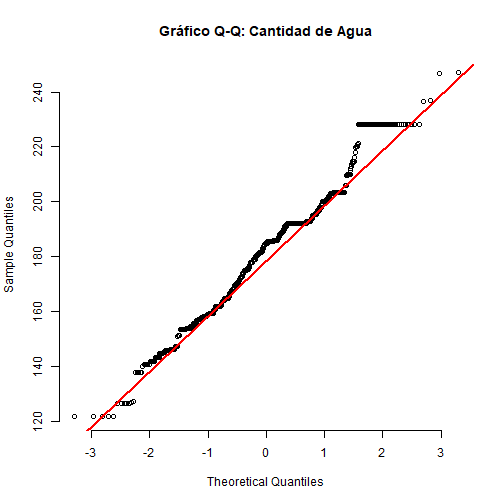
<p class="caption">plot of chunk unnamed-chunk-13</p>
</div>

``` r
qqnorm(df_clean$cemento, pch = 1, frame = FALSE, main = "Gráfico Q-Q: Cemento")
qqline(df_clean$cemento, col = "red", lwd = 2)
```

<div class="figure" style="text-align: center">
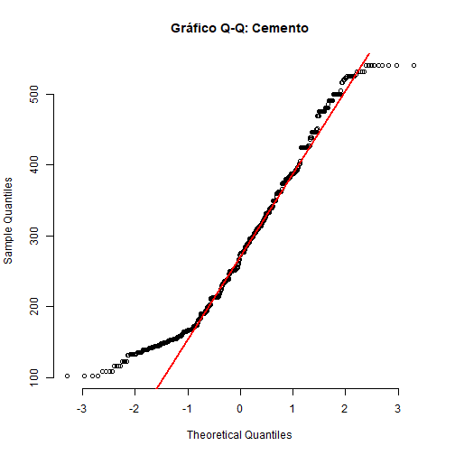
<p class="caption">plot of chunk unnamed-chunk-13</p>
</div>
2. Interpretación del Gráfico Q-Q para el Tiempo de Curado (Edad)

Falta de alineación y forma de "escalera": Al mirar este gráfico, los puntos no siguen una línea recta continua. En su lugar, vas a ver agrupaciones densas de puntos dispuestas de forma horizontal (como si fueran escalones) y muy separadas de la línea roja de referencia.

Por qué ocurre esto (Asimetría severa): Esta desviación extrema ocurre porque el tiempo de curado no es una variable continua natural en este experimento. Los laboratoristas toman medidas en días fijos normativos (3, 7, 14, 28, 56 días, etc.), creando "saltos" en la distribución. Además, como la enorme mayoría de las pruebas se hacen a los 28 días y muy pocas llegan a un año (365 días), la distribución tiene un sesgo altísimo hacia la izquierda.

Conclusión: La trayectoria de los puntos corrobora visualmente el pésimo resultado de su prueba de Shapiro-Wilk ($W = 0.59071$). La edad presenta una desviación radical respecto al modelo de campana de Gauss, confirmando una distribución discreta, marcadamente sesgada hacia la derecha (valores tempranos) y con una cola larga.


<!--chapter:end:02-eda-concrete.Rmd-->

